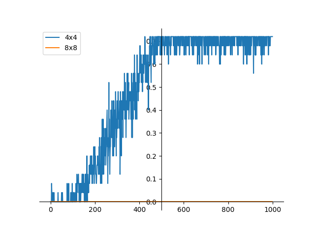
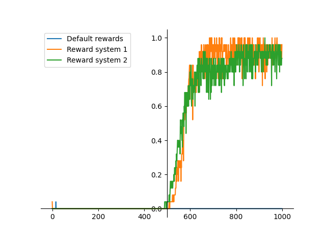
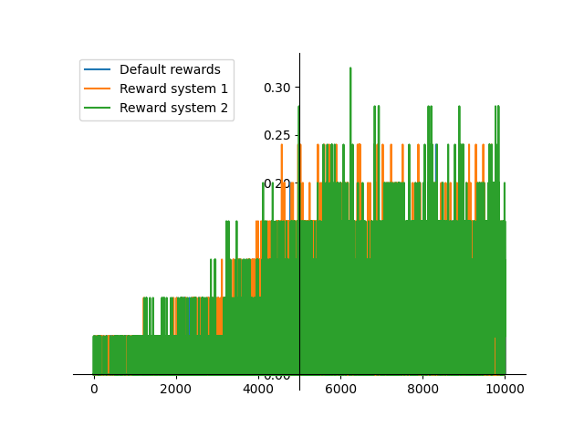

# Sprawozdanie
Mikołaj Garbowski

Przedmiotem zadania jest implementacja algorytmu Q-Learning i przeprowadzenie badań na temat stosowanego systemu nagród
na skuteczność w rozwiązywaniu problemu [FrozenLake8x8](https://gymnasium.farama.org/environments/toy_text/frozen_lake/)
z biblioteki gymnasium.

## Implementacja

### Epsilon decay
Ze względu na słabe uzyskiwane początkowo wyniki, postanowiłem zmodyfikować algorytm o mechanizm stopniowego obniżania 
wartości epsilon (prawdopodobieństwa wyboru losowego ruchu), początkowe
prawdopodobieństwo wynosi 1 i w miarę uczenia agenta maleje do wartości minimalnej (rośnie prawdopodobieństwo wyboru
akcji w sposób zachłanny) - taki mechanizm powinien poprawić zdolność agenta do eksploracji w początkowej fazie i
eksploatacji w późniejszej fazie.

### System nagród
Stany agenta podzielone są na kategorie

* sukces - agent dotarł do prezentu
* porażka - agent osiągnął limit kroków w epizodzie (flaga `truncated` z biblioteki gymnasium)
* dziura - agent wpadł do dziury
* uderzenie ściany - agent poszedł w kierunku ściany (nie ruszył się)
* nic - pozostałe, agent znajduje się na normalnym polu

Porównuję ze sobą działanie 3 systemów nagród

* Domyślny
  * 1 za sukces
  * 0 w przeciwnym wypadku
* Alternatywny nr 1
  * sukces: 1
  * porażka: -5
  * dziura: -10
  * ściana: -1
  * nic: 0
* Alternatywny nr 2
  * sukces: 1
  * porażka lub dziura: -10
  * w przeciwnym wypadku: 0

### Przyjęte wartości parametrów
Jeśli nie jest powiedziane inaczej przyjąłem domyślnie wartości

| Parametr                        | Wartość |
|---------------------------------|---------|
| szybkość uczenia                | 0.1     |
| współczynnik dyskontowania      | 0.9     |
| początkowy epsilon              | 1.0     |
| minimalny epsilon               | 0.03    |
| współczynnik zanikania epsilona | 0.5     |

### Ewaluacja działania algorytmu
Wykresy przedstawiają sumaryczne nagrody dla epizodu uśrednione na przestrzeni 25 niezależnych uruchomień algorytmu.

Po wytrenowaniu agenta uruchamiam go na 100 epizodów, współczynnik do odsetek tych epizodów,
które zakończyły się sukcesem. Wartość uśredniona z 25 niezależnych uruchomień.

## Eksperymenty

### Domyślne nagrody, plansza 4x4 vs 8x8
Porównanie działania algorytmu z domyślnym systemem nagród na planszy 4x4 i 8x8.
Bez poślizgu, 1000 epizodów.

Na planszy 4x4 osiąga zadowalające wyniki, wykres pokrywa się z przedstawionym na stronie przedmiotu,
agent uczy się stopniowo i osiąga szczytowy poziom ok. 0.7 po 500 epizodach. Współczynnik sukcesu 69.68%.

Na planszy 8x8 wyniki są fatalne, agentowi nie udaje się dojść do celu ani razu. Współczynnik sukcesu 0.00%.

### Porównanie systemów nagród bez poślizgu
Porównuję działanie agenta z przedstawionymi wyżej systemami nagród, na planszy 8x8, bez poślizgu, 1000 epizodów.

Domyślny system jest zupełnie nieskuteczny

System 1, który mocniej karze za wpadanie do dziury niż za nie dojście do celu oraz karze uderzanie w ścianę szybciej
osiąga maksymalną skuteczność - ok 650. epizodu.

System 2, który nie ma kary za uderzanie w ścianę i jednakowo karze niedojście do celu osiąga maksymalną skuteczność
później - ok. 800. epizodu.

Oba systemy zaczynają osiągać sukcesy dopiero w okolicy 500. epizodu i następnie uczą się bardzo szybko - dochodzą do
wysokiej skuteczności w ciągu ok 100 epizodów, postęp jest znacznie mniej równomierny niż w poprzednim eksperymencie
na mniejszej planszy.

| System nagród   | współczynnik sukcesu |
|-----------------|----------------------| 
| system domyślny | 0.00%                | 
| system 1        | 89.44%               |
| system 2        | 89.20%               |

### Porównanie systemów nagród z poślizgiem
Porównuję działanie agenta z przedstawionymi wyżej systemami nagród, na planszy 8x8 z poślizgiem, 10000 epizodów.

Wszystkie systemy osiągają niską skuteczność, wyniki agentów poprawiają się przez pierwsze 5000 epizodów, natomiast
trend nie jest wyraźnie dodatni i wyniki mocno oscylują.

Należy zwrócić uwagę na lepsze niż w poprzednich eksperymentach rezultaty dla domyślnego systemu nagród, który jednak
wypada najsłabiej z badanych.

Najlepiej sprawdził się system 2, który nie karał za uderzanie w ścianę, to mogło sprzyjać wyuczeniu się przez agenta
wąskiej ścieżki po prawej stornie planszy.

| System nagród   | współczynnik sukcesu |
|-----------------|----------------------| 
| system domyślny | 2.76%                | 
| system 1        | 5.28%                |
| system 2        | 6.72%                |

