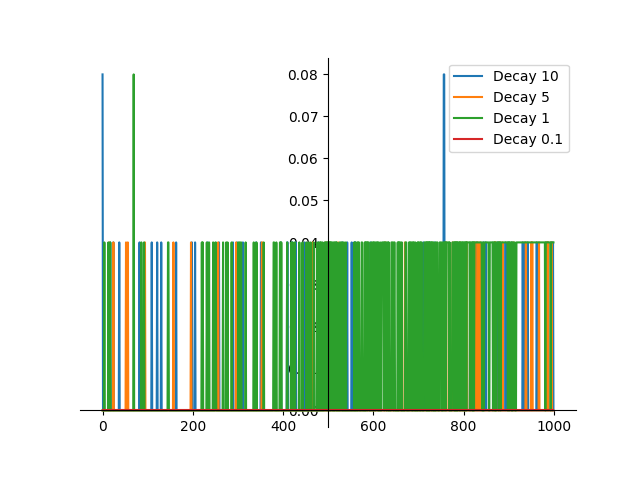

# Sprawozdanie

## experiment_1
Success rates:
* Default rewards: 73.72%
* Reward system 1: 97.68%
* Reward system 2: 85.60%

## experiment_2
Success rates:
* Default rewards: 0.00%
* Reward system 1: 0.00%
* Reward system 2: 0.00%

## experiment_3

Success rates:
* Default rewards: 12.88%
* Reward system 1: 40.60%
* Reward system 2: 4.28%

## experiment_4

Success rates:
* Decay 10: 0.32%
* Decay 5: 0.44%
* Decay 1: 3.84%
* Decay 0.1: 0.00%

